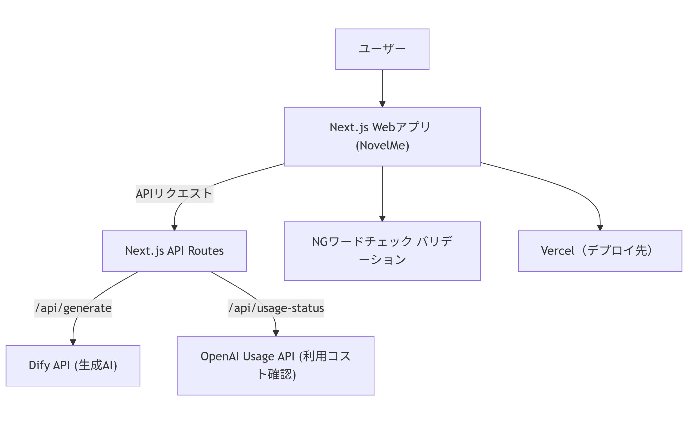

# プロジェクト名
NovelMe

## 概要
- ユーザーが自身の経歴や印象的なエピソードを入力すると、その人を主人公にした架空の小説の「タイトル」と「紹介文」をAI（LLM）で自動生成するWebアプリです。

### 目的・価値
- キャリアや人生の振り返りを促進し、自己肯定感やポジティブな気持ちを高める
- 非日常的な“自分が主人公”体験を気軽に楽しめる

### ターゲットユーザー
- キャリアについて考えたい、かつ新しいものを試すのが好きな20代〜50代

## 特徴（Features）
- ユーザー向け主要機能
   - 小説のジャンルを選択する
   - 経歴、印象的なエピソードを入力する
   - 小説の表紙タイトルと紹介文をAI（LLM）で自動生成する
- 管理者向け主要機能
   - サービス停止の切り替え（API利用数管理）

### 重要な注意点
- ユーザー登録・ログイン機能は実装しない（完全匿名利用）
- 不適切な内容（非人道的・性的・犯罪等）は生成しないようブロック
- LLM APIの利用状況によって、簡単にサービス停止＆停止中画面を出せる

### 今後の拡張（MVP後）
- 小説の表紙画像（書影）の自動生成機能
- SNSシェア機能

## 技術スタック・システム構成
## 開発手法
- AI駆動開発
   - Windsurf × GPT-4.1 を利用した Vibe Codingで開発
   - 利用範囲はアイデアから設計、技術選択、コーディング、テスト、デプロイまで全行程
   - 開発者はそのガードレールとしてAIの提案を取捨選択しながら、開発を進める

## 開発環境
- Node.js v22 以上（推奨：LTS最新版）
- 依存パッケージは `package.json` 参照
- lint: ESLint
- テスト環境：Jest
- デプロイ環境：Vercel
- 環境変数：`.env`
   - `DIFY_API_KEY`
- プロジェクトリポジトリ：https://github.com/misakiotb/novelme_app

### フロントエンド
- Next.js
- TailwindCSS
- React 19

### バックエンド/APIサーバー
- Node.js
- 外部API：Dify API
   - 生成AI のエンドポイント、プロンプトは Dyfy で管理
  
### デプロイ・運用
- Vercel（Next.js公式）
- 環境変数でAPIキーや管理者用設定を安全に管理

## 開発方針
- モダン開発、アジャイル、ベストプラクティス、ウェルアーキテクチャを重視
- 仕様や決定事項はドキュメントで管理

### セキュリティ方針
- バックエンド用のログファイルや管理者向けデータは、APIルートのサーバーサイドコードからのみアクセス可能
- フロントエンドや一般ユーザーからは直接アクセスできない
- 管理者用APIには、環境変数によるシークレットキーやIP制限、URL非公開などの制限を設ける
- デプロイ先のファイル保存は一時領域（/tmp等）を利用し、本格運用時はクラウドストレージ等に移行可能
- Next.jsのAPIルートはサーバーサイドのみで動作し、クライアントからは隠蔽される

### ドキュメントガイドライン
- ドキュメント形式は JSDoc（TSDoc）コメント
- エンドポイント関数には関数レベルのドキュメントを追加
- フォルダ／モジュール単位の README は不要

## システム構成図

## 参考リンク

- [Next.js公式](https://nextjs.org/)
- [Dify公式](https://dify.ai/)
- [Vercel公式](https://vercel.com/)

## ライセンス
- MIT License

## コントリビューション
- バグ報告・機能要望はIssueでお願いします。

## 著者／連絡先
- Misaki Otobe https://github.com/misakiotb

## 変更履歴
- 2025-04-23: 初版作成
- 2025-04-23: 技術スタック・構成とセキュリティ方針を追記
- 2025-05-01: 全体を再構成
- 2025-05-02: AI駆動開発方針、システム構成図を追加

